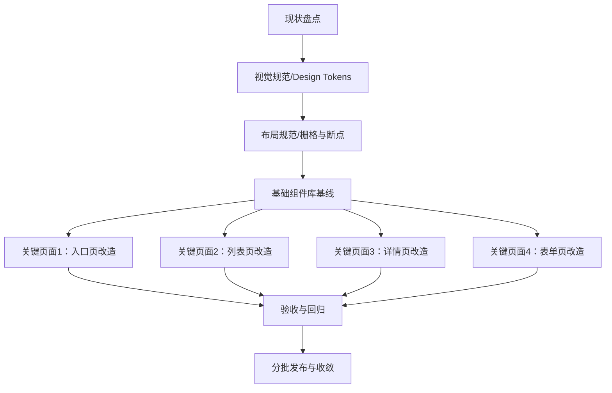

## 1. Product Overview
对现有系统进行“UI 全局优化”，以统一视觉规范、组件与布局规范为核心，提升一致性、可用性与开发维护效率。
本次不改变业务功能与信息架构，重点做“样式体系 + 组件体系 + 关键页面改造 + 可验收标准”。

## 2. Core Features

### 2.1 Feature Module
本次 UI 全局优化需求由以下关键页面/范围构成：
1. **全局视觉与样式规范**：Design Tokens（颜色/字体/间距/圆角/阴影/层级）、暗色/高对比（如适用）、图标与插画规则。
2. **组件/布局规范与组件库基线**：基础组件统一、交互状态统一、栅格与响应式断点、页面骨架与容器规范。
3. **关键页面改造（范围受控）**：选择对全站影响最大、访问最高频的页面进行样式与组件替换，确保可快速落地。
4. **验收与回归标准**：视觉一致性、可访问性、性能与回归测试基线，定义“可交付”的客观标准。

### 2.2 Page Details
> 说明：你当前未提供系统页面清单；下述以“典型关键页面类型”定义改造范围与验收口径。实际落地时，将该清单映射到你现有路由/菜单中的对应页面即可。

| Page Name | Module Name | Feature description |
|---|---|---|
| 全局（全站） | 视觉规范（Design Tokens） | 统一定义并落地：主/辅色、语义色（成功/警告/错误/信息）、中性色阶、字体（字号/字重/行高）、间距（4/8 基线）、圆角、阴影、描边、层级（z-index）、动效时长与缓动。 |
| 全局（全站） | 可访问性基线 | 统一按钮/链接可聚焦样式；文本/背景对比度达到规范；表单错误提示可被读屏识别（如适用）；键盘可达核心操作。 |
| 全局（全站） | 布局规范（容器/栅格/断点） | 定义内容最大宽度、左右边距、栅格（如 12 栅格）与常用页面模板（顶部导航 + 内容区、侧栏 + 内容区）；定义响应式断点与组件在断点下的折行/隐藏规则。 |
| 全局（全站） | 组件规范（基础交互一致性） | 统一按钮/输入/下拉/弹窗/提示/表格/分页/标签/面包屑等组件：尺寸规格（S/M/L）、禁用/加载/悬停/按下/选中状态、文案与图标间距、错误态与校验样式。 |
| 全局（全站） | 图标与插画规范 | 统一图标库来源、尺寸（如 16/20/24）、线性/面性风格、对齐与色值规则；避免同一页面混用多套风格。 |
| 关键页面 1：入口页（如首页/工作台） | 页面结构改造 | 按统一模板重排：顶部区域（标题/关键指标/主操作）、内容区（卡片/表格/列表）、空状态与加载骨架；替换为统一组件与间距体系。 |
| 关键页面 2：列表页（如资源列表/订单列表） | 列表/筛选/表格统一 | 统一筛选区布局（折叠/展开规则）、表格行高与密度、列对齐、操作列样式；分页与批量操作样式统一。 |
| 关键页面 3：详情页（如资源详情/订单详情） | 信息呈现与动作区统一 | 统一信息分组（卡片/分区标题）、关键字段排版（两列/三列）、主次操作按钮位置；状态标签与时间线样式一致。 |
| 关键页面 4：表单页（新建/编辑） | 表单布局与校验统一 | 统一表单栅格、label 对齐、必填标识、错误提示展示（字段级/表单级）、提交区固定位置；支持保存中/防重复提交视觉反馈。 |
| 全局（全站） | 迁移与兼容策略 | 允许新旧样式并存的过渡期：通过“页面级切换”或“组件级替换”逐步收敛；明确不在本期改造的页面与后续计划。 |

## 3. Core Process
### 3.1 主要流程（面向项目交付）
1. 现状盘点：梳理当前样式来源、组件重复/变体、页面模板类型与高频入口页面。
2. 规范制定：输出 Design Tokens、布局/栅格/断点、组件规范（含状态与尺寸）。
3. 组件基线落地：先完成最基础且影响面最大的组件（Button/Input/Select/Modal/Toast/Table）。
4. 关键页面改造：按“入口页 → 列表页 → 详情页 → 表单页”的顺序替换为新规范与新组件。
5. 验收与回归：按验收清单进行视觉走查、交互一致性检查、可访问性与性能回归。
6. 发布与收敛：灰度发布（如具备条件）或分批上线；收敛遗留样式与组件分叉。

### 3.2 页面导航/改造依赖关系（Mermaid）

---

## 4. 验收标准（必须满足）
### 4.1 视觉与一致性
- 全站使用同一套 Design Tokens：颜色、字体、间距、圆角、阴影、描边不再出现“页面私货”。
- 同类组件在不同页面的尺寸、状态、间距一致（按钮/输入/弹窗/表格等）。
- 页面布局遵循统一容器宽度与栅格规则，标题层级与间距符合规范。

### 4.2 交互与可用性
- 所有可点击元素具备清晰 hover/active/focus/disabled/loading 状态。
- 表单校验：字段错误提示位置、文案风格、边框/提示色一致；提交失败有统一 toast/inline 告警样式。
- 列表页：筛选区、分页区、表格密度一致；空状态/无结果/加载骨架统一。

### 4.3 可访问性（基线）
- 关键操作可通过键盘 Tab 访问，focus 样式清晰可见。
- 文本与背景对比度满足你们内部规范（若无规范，以 WCAG AA 为目标）。

### 4.4 性能与回归
- 关键页面首屏不因样式/组件重构出现明显性能退化（以你们现有监控或 Lighthouse 对比为准）。
- 关键流程回归：入口→列表→详情→编辑/提交链路可正常完成。

### 4.5 范围控制（不做什么）
- 不新增业务功能、不重做信息架构、不改变后端接口；仅做 UI 规范化与替换。
- 非关键页面暂不纳入本期改造（除非它复用到新组件而“被动受益”）。
