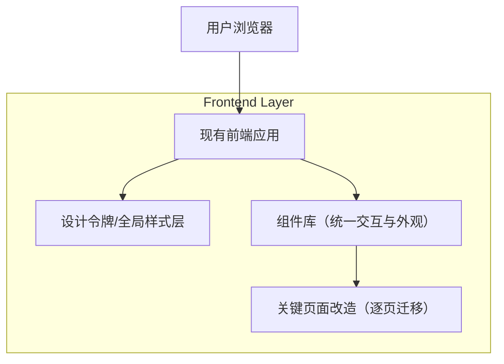

## 1.Architecture design

## 2.Technology Description
- Frontend: React@18 + TypeScript +（沿用现有构建工具：Vite/Webpack 其一）
- UI Style: CSS Variables（Design Tokens）+（沿用现有样式方案：CSS Modules / TailwindCSS / styled-components 其一）
- Backend: None（本次 UI 全局优化不引入后端改造）

> 原则：最大化复用你现有技术栈，不强制引入新 UI 框架；以“Design Tokens + 组件封装”实现统一。

## 3.Route definitions
> 由于缺少你现有路由清单，这里以“页面类型”给出改造优先级映射。

| Route（示例） | Purpose |
|---|---|
| /（或 /dashboard） | 入口页：统一页面模板、卡片/指标/主操作区样式 |
| /list（或 /xxx/list） | 列表页：统一筛选区、表格密度、分页与批量操作 |
| /detail/:id | 详情页：统一信息分组、状态标签、主次操作区 |
| /create 或 /edit/:id | 表单页：统一表单栅格、校验错误态、提交区与 loading 状态 |

## 4.（实现要点）Design System 与组件落地方案
### 4.1 Design Tokens（统一来源，单向下发）
- 定义 token 命名规范（建议语义化优先）：
  - 颜色：--color-primary / --color-success / --color-danger / --color-text-1 / --color-bg-1 …
  - 字体：--font-size-1…、--font-weight-regular…、--line-height-compact…
  - 间距：--space-1=4px、--space-2=8px…（4/8 基线）
  - 圆角：--radius-1…；阴影：--shadow-1…；描边：--border-color…
- 落地形态：以 CSS Variables 为“最终形态”，便于主题切换与全局覆盖；在组件层只消费 token，不写死色值与像素。

### 4.2 全局样式层（Reset + 基础排版）
- 基础 reset（margin/padding/box-sizing/字体渲染）。
- 统一 body 背景、默认字体与字号，统一链接样式、可聚焦 focus ring。
- 定义通用布局工具类/组件：PageContainer、Section、Stack、Inline、Divider。

### 4.3 组件库建设策略（先基建，后页面）
- 分层：
  1) 基础组件：Button、IconButton、Input、Textarea、Select、Checkbox、Radio、Switch
  2) 反馈组件：Modal/Dialog、Drawer、Toast、Tooltip、Popover、Loading/Spinner、Skeleton
  3) 数据展示：Table、Pagination、Tag/Badge、Empty、Breadcrumb
  4) 业务壳组件：Header、Sidebar、PageHeader（标题+面包屑+操作区）
- 统一要求：
  - 尺寸体系：S/M/L（高度、内边距、字号、图标大小随尺寸联动）
  - 状态体系：default/hover/active/focus/disabled/loading/error
  - 组合规范：按钮组、表单项（label/required/help/error）与弹窗页脚主次按钮顺序固定

### 4.4 关键页面迁移策略（风险最小化）
- 迁移原则：
  - “页面级开关”优先（每次改一个页面），避免全站一次性替换导致回归不可控。
  - “组件替换”与“样式替换”分离：先让页面接入新组件，再逐步删除旧样式与旧组件。
- 兼容机制：
  - 新旧样式隔离：通过命名空间（如 .ds- 前缀）或 CSS Layer/Scoped 方案避免互相污染。
  - 禁止页面新增临时样式：新增 UI 必须通过 token/组件实现。

### 4.5 质量与验收自动化（建议项，不阻塞）
- Lint/规范：约束禁止硬编码色值（可用 stylelint 规则或自定义检查脚本）。
- 视觉回归：对关键页面做截图对比（如你已有 Playwright/Cypress，可复用）。
- 可访问性扫描：关键页面跑基础 a11y 检查（如你已有工具链，可复用）。

## 5.（交付物清单）
- tokens：颜色/字体/间距/圆角/阴影/描边/层级/动效
- 全局样式：reset、排版、focus、容器与栅格
- 组件库：基础组件 + 反馈组件 + 数据展示组件（以 PRD 为准）
- 页面改造：入口页/列表页/详情页/表单页（以你现有系统映射为准）
- 验收材料：验收清单 + 关键页面对比截图（改造前/后）

## 6.Data model(if applicable)
本次 UI 全局优化不涉及数据模型与数据库变更。
